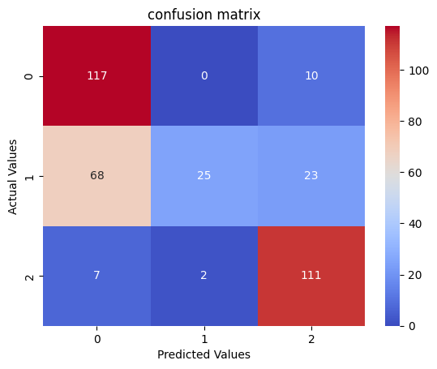
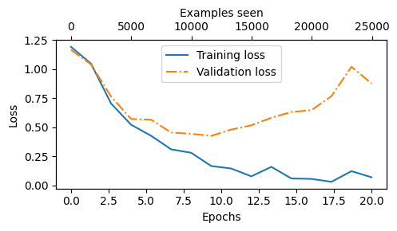
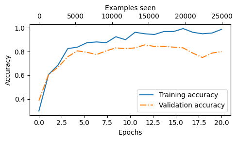

# 📈 Financial News Sentiment Classification with Fine-Tuned GPT-2 (124M)

Adapting a pretrained **GPT-2 Small (124M)** autoregressive language model for 3-class financial news sentiment analysis by replacing the original language modeling head with a sequence classification head in **PyTorch**.

[](https://www.python.org/)
[](https://pytorch.org/)
[](LICENSE)


---

## 📌 Project Overview

Autoregressive models like GPT-2 are natively pretrained for next-token generation with causal masking. This project demonstrates how to repurpose base GPT-2 weights into a high-utility sequence classifier (inspired by concepts in Chapter 6 of Sebastian Raschka's *Build a Large Language Model from Scratch*).

### 🛠️ Architecture Adaptation & Pooling

1. **Head Replacement**: The original language modeling head (`out_head: 768 -> 50,257`) was replaced with a custom classification projection layer (`nn.Linear(768, 3)`).
2. **Causal Pooling Strategy**: Because GPT-2 employs causal self-attention, the hidden state of the **last token in the sequence** aggregates information across all preceding tokens. Classification logits are extracted strictly at this boundary:

$$\text{logits} = \mathbf{h}_{[-1]} \mathbf{W}_{\text{classifier}} + \mathbf{b}$$

3. **Domain Fine-Tuning**: The model was fine-tuned on the Financial PhraseBank dataset to classify financial headlines into **Neutral**, **Positive**, and **Negative**.

---

## 📊 Dataset & Splits

The dataset consists of financial news statements labeled with three sentiment classes:

* **0: Neutral**
* **1: Positive**
* **2: Negative**

Evaluation was conducted on a held-out test split of **363 samples**.

---

## 📈 Evaluation & Results

### Final Test Performance (363 Samples)

* **Overall Test Accuracy**: **69.70%**
* **Macro Average F1**: **0.6414**
* **Weighted Average F1**: **0.6464**

| Class | Precision | Recall | F1-Score | Support |
| --- | --- | --- | --- | --- |
| **Neutral** | 0.6094 | **0.9213** | 0.7335 | 127 |
| **Positive** | **0.9259** | 0.2155 | 0.3497 | 116 |
| **Negative** | 0.7708 | **0.9250** | **0.8409** | 120 |
| **Accuracy** |  |  | **0.6970** | 363 |
| **Macro Avg** | 0.7687 | 0.6873 | 0.6414 | 363 |
| **Weighted Avg** | 0.7639 | 0.6970 | 0.6464 | 363 |

> **Key Takeaway**: The model demonstrates exceptional recall on **Negative (92.50%)** and **Neutral (92.13%)** statements. For **Positive** sentiment, it exhibits very high precision (**92.59%**), indicating that while it is conservative when predicting positive trends, its positive calls are highly reliable.

---

## 📉 Visualizations

### 1. Confusion Matrix

### 2. Training & Validation Curves



---

## 🚀 Quickstart & Inference

### 1. Installation

```bash
git clone https://github.com/Hosein541/GPT2-financial-sentiment-classifier.git
cd GPT2-financial-sentiment-classifier

pip install -r requirements.txt

```


## 📂 Repository Structure

```text
├── assets/
│   ├── confusion_matrix.png       # Evaluation Confusion Matrix
│   ├── loss_curve.png             # Training & Validation loss curves
│   └── accuracy_curve.png         # Training & Validation accuracy curves
├── utils.py                       # Core GPT architecture and utilities
├── .py                       # Training loop with validation and checkpointing
├──                    # Test set evaluation and metric generation
├── requirements.txt               # Dependencies
└── README.md                      # Documentation

```

---

## 📜 Acknowledgements

* **Sebastian Raschka** for the foundational GPT architecture implementation in *Build a Large Language Model from Scratch*.
* **OpenAI** for releasing the original GPT-2 model weights.

---
